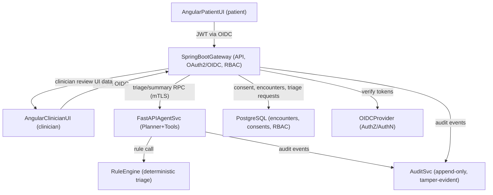
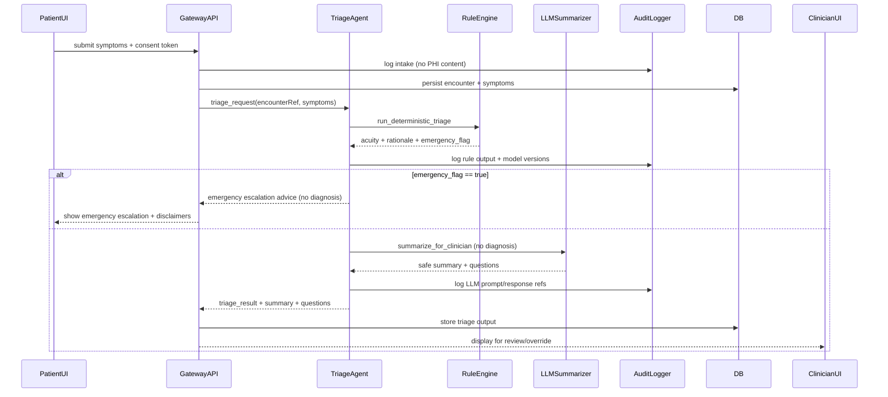

<!-- Blueprint generated for executive review. Scope: safe, non-diagnostic clinical decision support. -->
# Patient Triage & Symptom Agentic AI System — Executive Blueprint

## Safety Posture (non-negotiable)
- No diagnosis or treatment claims; language must stay cautious and advisory.
- AI outputs are suggestions; clinicians must review/approve before acting.
- Deterministic rule triage always runs; emergencies trigger immediate escalation.
- All AI actions, prompts, model versions, and tool calls are auditable; no PHI in logs.

## High-Level Architecture

### Service Responsibilities
- **Angular Frontend**: role-based flows; explicit consent; structured symptom entry; chat UI; emergency escalation banner; clinician dashboard for review/override; audit viewer (admin/clinician).
- **SpringBoot Gateway**: OAuth2/OIDC, JWT validation, RBAC; session + consent checks; API rate limiting; input validation; PII/PHI redaction for logs; orchestrates calls to AI Agent; persists encounters; writes audit events; exposes admin audit endpoints.
- **FastAPI Agent Service**: planner + tools; deterministic rule triage before any LLM summarization; knowledge retrieval constrained to vetted medical content; safety filter; prompt + tool audit logging; no PHI retention beyond session.
- **Rule Engine**: deterministic triage paths; emergency detection (e.g., chest pain + dyspnea) → immediate escalate; produces acuity level + rationale; unit-test heavy.
- **Audit Service**: append-only, hash-chained logs; stores prompts, tool invocations, model + adapter versions, user/role, consent token; admin-only query.
- **PostgreSQL**: encounters, symptoms, consents, clinician decisions, RBAC roles, audit pointers; encryption at rest.

### Data Flow (happy path)
1) Patient signs in (OIDC) → gives consent → enters structured symptoms.  
2) Gateway validates JWT, consent, rate limits → stores encounter + symptoms.  
3) Gateway calls Agent (mTLS) → Agent runs rule engine first → then LLM summarizer for wording.  
4) Agent returns triage level + safe summary + clarifying questions → Gateway stores + audits.  
5) Clinician dashboard shows AI output; clinician approves/overrides → decision stored + audited.  
6) Admin can review audit trails; PHI never leaves boundary; logs are redacted and hash-chained.

## Agentic Flow (deterministic-first)

### Agent Components
- **Planner**: decides next step (clarify vs triage vs summarize) based on session context and rule outputs.
- **Tools**: deterministic rule triage (must run first), curated retrieval (no web), LLM summarizer (LoRA LLaMA, safe-tuned).
- **Safety Filter**: strips diagnostic/treatment claims; enforces disclaimers; checks for forbidden patterns.
- **Memory**: session-scoped only; no long-term PHI storage in agent; persistent data lives in Gateway/DB.
- **Audit Hooks**: every prompt/tool call logged with hashes, timestamps, model+adapter version; PHI fields redacted.

## Rule-Based Triage (deterministic)
- Inputs: age, vitals (if available), symptom list, onset, severity, risk factors, pregnancy flag.  
- Outputs: acuity level (e.g., Emergent, Urgent, Routine), rationale, emergency flag, suggested clarifiers (deterministic).  
- Emergency triggers (examples):  
  - Chest pain + dyspnea, neuro deficits, uncontrolled bleeding, anaphylaxis signs.  
  - Falls with neuro changes, suicidal ideation, altered mental status.  
- Tests: exhaustive unit tests per rule; property tests for monotonicity (adding red-flag symptoms never lowers acuity).

## API Surface (Gateway → Agent)
- Auth: OAuth2/OIDC bearer JWT; mTLS between Gateway and Agent; RBAC enforced at Gateway.
- Content-type: JSON; trace-id and encounter-id propagated; no PHI in headers.
- Endpoints (representative):
  - `POST /encounters`: body {patientId, consentToken}; returns encounterId.
  - `POST /encounters/{id}/symptoms`: body {structuredSymptoms, freeText?, vitals?}; validates consent + RBAC.
  - `POST /encounters/{id}/triage`: gateway → agent RPC; body {encounterRef, symptomsRef}; returns {acuity, rationale, emergencyFlag, clarifyingQuestions, summaryForClinician, disclaimers}.
  - `POST /encounters/{id}/clinician-review`: body {decision: approved|overridden, notes}; role=clinician.
  - `GET /audits/{id}`: admin only; server-side redaction; paginated.

### Agent RPC Contract (FastAPI)
- `POST /triage`:  
  Request: {encounterRef, symptoms[], vitals?, demographicsLite? (age band, sex, pregnancyFlag)}  
  Response: {acuity, emergencyFlag, rationale, clarifyingQuestions[], summaryForClinician, safetyWarnings, modelVersion, adapterVersion, ruleVersion, traceId}  
- `POST /summarize` (internal): same inputs; used only after rule output; never returns diagnoses.

## Security & Compliance Model
- TLS everywhere; mTLS Gateway↔Agent↔Rule; HSTS at frontend.
- OAuth2/OIDC with short-lived JWTs; refresh via OIDC provider; audience + issuer validation; key rotation.
- RBAC roles: Patient, Clinician, Admin; fine-grained scopes per endpoint.
- Consent enforcement at Gateway; triage calls require active consent token.
- Data protection: PII/PHI encrypted at rest (Postgres TDE or disk encryption); column-level encryption for sensitive fields; secrets via vault/KMS.
- Logging: no PHI in app logs; audit logs hash-chained and append-only; store prompt refs (not raw PHI).
- Zero trust: no direct frontend→LLM; Gateway mediates all AI; input validation + WAF + rate limiting.
- Retention: configurable per-tenant; audit logs immutable within retention window; export with access controls.
- Explainability: persist rule path + features used; include model+adapter versions; keep prompt templates versioned.

## Observability
- Metrics: request rates/latency, rule execution time, LLM call counts, safety filter blocks, emergency flags, rate-limit hits.
- Traces: propagate trace-id from frontend through Gateway→Agent→Rule; sample in prod.
- Logs: structured JSON; redaction middleware; audit stream separated from app logs.
- Alerts: emergency flag spike, safety filter block increase, auth failures, latency SLO breaches, pod restarts.

## Deployment
- **Docker Compose (dev/local)**: services (gateway, agent, rule, audit, postgres, oidc mock, frontend) with .env for non-secret configs; real secrets via env or mounted files; healthchecks per service.
- **Kubernetes (prod)**:  
  - Namespaces per env; mTLS mesh (e.g., Istio/Linkerd) or cert-manager-issued certificates.  
  - Deployments for gateway, agent, rule, audit; StatefulSet for Postgres or managed DB.  
  - Secrets via K8s Secrets/ExternalSecrets to cloud KMS; ConfigMaps for non-secret configs.  
  - HPAs on CPU + p95 latency; PodDisruptionBudgets; readiness/liveness probes.  
  - Ingress with TLS; WAF; rate limiting at gateway/ingress.  
  - Centralized logging (ELK/OTel) and metrics (Prometheus/Grafana); tracing (OTel Collector).  
  - Rolling updates; blue/green for model or rule version changes; feature flags for adapters.

## Testing & Validation Matrix
- Unit: rule engine coverage, safety filter parsing, RBAC guards, input validation.
- Integration: Gateway↔Agent RPC, consent enforcement, audit logging, redaction checks.
- Safety: forbidden output tests (diagnosis/treatment claims), emergency escalation tests, adversarial prompts.
- Mocked LLM: deterministic fixtures in CI; no real model calls.
- Load: p95 latency on triage endpoints under target QPS; soak tests for memory leaks.
- UX: consent-first flow, disclaimers visible, emergency banner paths, clinician override flow.
- Security: JWT validation tests, mTLS verification in staging, SQLi/XSS fuzz, rate-limit behavior.

## Operational Playbooks
- Model/adapter versioning: include version in every response + audit; rollouts via feature flag with canaries.
- Incident response: playbooks for safety filter failures, elevated emergency flags, auth outages; audit queries for investigation.
- Data handling: PHI export requests require admin approval; audit logs immutable; retention expiry jobs.

